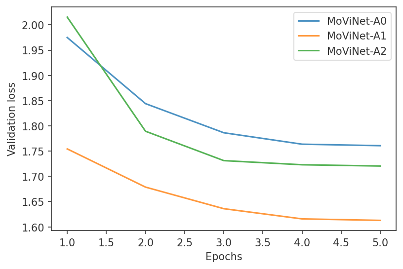
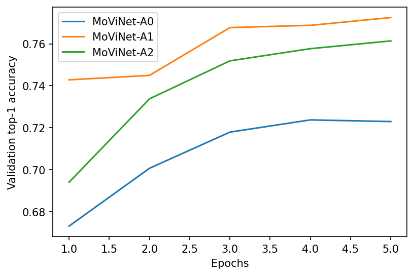
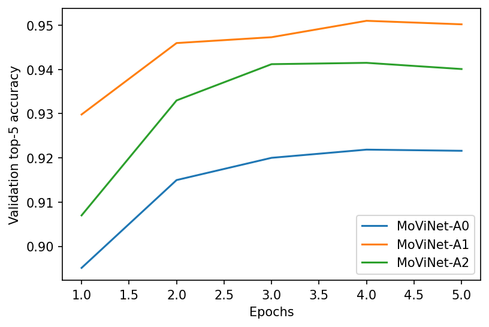

# Transfer learning on MoViNet using UCF101 data set

<details>
  <summary>Table of Contents</summary>
  <ol>
    <li>
      <a href="#about-the-project">About The Project</a>
    </li>
    <li><a href="#usage">Usage</a>
    </li>
    <li><a href="#results">Results</a></li>
    <li><a href="#contributing">Contributing</a></li>
    <li><a href="#license">License</a></li>
    <li><a href="#contact">Contact</a></li>
  </ol>
</details>

<!-- ABOUT THE PROJECT -->
## About The Project

This project focuses on applying transfer learning to fine-tune the MoViNet architecture in the UFC101 data set. We also provide the necessary code to convert the models to TFLite format and be able to use them on Andriod mobile phones.

This project was developed by Mike Bermeo, Jean Camacho, and Leo Ramos students at [Yachay Tech University](https://www.yachaytech.edu.ec/en/).

<p align="right">(<a href="#top">back to top</a>)</p>


### Built With
* [Python](https://www.python.org/)
* [TensorFlow](https://www.tensorflow.org/)
* [Android Studio](https://developer.android.com/studio)

<p align="right">(<a href="#top">back to top</a>)</p>

<!-- GETTING STARTED -->
## Usage

### Installation

pip install git+https://github.com/Leo-Thomas/Transfer-Learning-MoViNet-UCF101.git

### Install necessary libraries and dependencies

`!pip install remotezip tqdm opencv-python==4.5.2.52 opencv-python-headless==4.5.2.52 tf-models-official`
```python
import os

import tqdm
import random
import pathlib
import itertools
import collections

import cv2
import numpy as np
import remotezip as rz
import seaborn as sns
import matplotlib.pyplot as plt

import keras
import tensorflow as tf
import tensorflow_hub as hub
from tensorflow.keras import layers
from tensorflow.keras.optimizers import Adam
from tensorflow.keras.losses import SparseCategoricalCrossentropy

import tensorflow_datasets as tfds
from official.vision.configs import video_classification
from official.projects.movinet.configs import movinet as movinet_configs
from official.projects.movinet.modeling import movinet
from official.projects.movinet.modeling import movinet_layers
from official.projects.movinet.modeling import movinet_model
```
### Download, extract, and split UCF101 data set

```python
dataset_name = 'ucf101'

builder = tfds.builder(dataset_name)

config = tfds.download.DownloadConfig(verify_ssl=False)
builder.download_and_prepare(download_config=config)
     
```
```python
num_classes = builder.info.features['label'].num_classes
num_examples = {
    name: split.num_examples
    for name, split in builder.info.splits.items()
}

print('Number of classes:', num_classes)
print('Number of examples for train:', num_examples['train'])
print('Number of examples for test:', num_examples['test'])
print()

builder.info
```

```python

batch_size = 8
num_frames = 8
frame_stride = 10
resolution = 172

def format_features(features):
  video = features['video']
  video = video[:, ::frame_stride]
  video = video[:, :num_frames]

  video = tf.reshape(video, [-1, video.shape[2], video.shape[3], 3])
  video = tf.image.resize(video, (resolution, resolution))
  video = tf.reshape(video, (-1, num_frames, resolution, resolution, 3))
  video = tf.cast(video, tf.float32) / 255.

  label = tf.one_hot(features['label'], num_classes)
  return (video, label)
 
train_dataset = builder.as_dataset(
    split='train',
    batch_size=batch_size,
    shuffle_files=True)
train_dataset = train_dataset.map(
    format_features,
    num_parallel_calls=tf.data.AUTOTUNE)
train_dataset = train_dataset.repeat()
train_dataset = train_dataset.prefetch(2)

test_dataset = builder.as_dataset(
    split='test',
    batch_size=batch_size)
test_dataset = test_dataset.map(
    format_features,
    num_parallel_calls=tf.data.AUTOTUNE,
    deterministic=True)
test_dataset = test_dataset.prefetch(2)
```

### Download a pre-trained MoViNet model

```python
model_id = 'a1' #---> You can change this for a0 (light), or a2 (robust)
resolution = 172

tf.keras.backend.clear_session()

backbone = movinet.Movinet(
    model_id=model_id,
    causal=True,
    conv_type='2plus1d',
    se_type='2plus3d',
    activation='swish',
    gating_activation='sigmoid'
)
backbone.trainable = False

# Set num_classes=600 to load the pre-trained weights from the original model
model = movinet_model.MovinetClassifier(
    backbone, num_classes=600)
model.build([1, 1, 1, 1, 3])

# Load pre-trained weights, be sure you change de model id
!wget https://storage.googleapis.com/tf_model_garden/vision/movinet/movinet_a1_stream.tar.gz -O movinet_a1_stream.tar.gz -q
!tar -xvf movinet_a1_stream.tar.gz

checkpoint_dir = f'movinet_{model_id}_stream'
checkpoint_path = tf.train.latest_checkpoint(checkpoint_dir)
checkpoint = tf.train.Checkpoint(model=model)
status = checkpoint.restore(checkpoint_path)
status.assert_existing_objects_matched()
```

```python
def build_classifier(batch_size, num_frames, resolution, backbone, num_classes, freeze_backbone=False):
  """Builds a classifier on top of a backbone model."""
  model = movinet_model.MovinetClassifier(
      backbone=backbone,
      num_classes=num_classes)
  model.build([batch_size, num_frames, resolution, resolution, 3])

  return model
```

```python
model = build_classifier(batch_size, num_frames, resolution, backbone, 101)
```

### Finetune on UFC101 data set

```python
num_epochs = 5

train_steps = num_examples['train'] // batch_size
total_train_steps = train_steps * num_epochs
test_steps = num_examples['test'] // batch_size


loss_obj = tf.keras.losses.CategoricalCrossentropy(
    from_logits=True,
    label_smoothing=0.1)

metrics = [
    tf.keras.metrics.TopKCategoricalAccuracy(
        k=1, name='top_1', dtype=tf.float32),
    tf.keras.metrics.TopKCategoricalAccuracy(
        k=5, name='top_5', dtype=tf.float32),
]

initial_learning_rate = 0.01
learning_rate = tf.keras.optimizers.schedules.CosineDecay(
    initial_learning_rate, decay_steps=total_train_steps,
)
optimizer = tf.keras.optimizers.RMSprop(
    learning_rate, rho=0.9, momentum=0.9, epsilon=1.0, clipnorm=1.0)

model.compile(loss=loss_obj, optimizer=optimizer, metrics=metrics)
```

```python

checkpoint_path = f"movinet_{model_id}_base_checkpoint/cptk-1"
checkpoint_dir = os.path.dirname(checkpoint_path)

cp_callback = tf.keras.callbacks.ModelCheckpoint(filepath=checkpoint_path,
                                                 save_weights_only=True,
                                                 verbose=1,)
```

```python
results = model.fit(train_dataset,
                    validation_data=test_dataset,
                    epochs=num_epochs,
                    steps_per_epoch=train_steps,
                    validation_steps=test_steps,
                    validation_freq=1,
                    callbacks=[cp_callback],
                    verbose=1)
results.history
```

```python
weights=model.get_weights()
```

### Export model (TFlite)

```python
from official.projects.movinet.tools import export_saved_model
```
```python  
input_shape = [1, 1, 172, 172, 3]
batch_size, num_frames, image_size, = input_shape[:3]

tf.keras.backend.clear_session()
# Create the model
input_specs = tf.keras.layers.InputSpec(shape=input_shape)
stream_backbone = movinet.Movinet(
    model_id='a1',
    causal=True,
    input_specs=input_specs,
    conv_type='2plus1d',
    se_type='2plus3d',
    activation='swish',
    gating_activation='sigmoid',
    use_external_states=True)
stream_backbone.trainable=False
stream_model = movinet_model.MovinetClassifier(
    backbone=stream_backbone,
    num_classes=101,
    output_states=True)
stream_model.build([1, 1, 172, 172, 3])
stream_model.set_weights(weights)
stream_model.get_weights()[0] 
model.get_weights()[0]
```
```python
saved_model_dir=f"/my_model/movinet_{model_id}_stream_UCF101"
export_saved_model.export_saved_model(
    model=stream_model,
    input_shape=input_shape,
    export_path=saved_model_dir,
    causal=True,
    bundle_input_init_states_fn=False)
     

converter = tf.lite.TFLiteConverter.from_saved_model(saved_model_dir)
tflite_model = converter.convert()

with open(f'movinet_{model_id}_stream.tflite', 'wb') as f:
  f.write(tflite_model)
```

### Load TFlite model

```python
# Create the interpreter and signature runner
interpreter = tf.lite.Interpreter(model_path=f'movinet_{model_id}_stream.tflite')
runner = interpreter.get_signature_runner()

init_states = {
    name: tf.zeros(x['shape'], dtype=x['dtype'])
    for name, x in runner.get_input_details().items()
}
del init_states['image']
```

```python
# Download example gif
!wget https://github.com/tensorflow/models/raw/f8af2291cced43fc9f1d9b41ddbf772ae7b0d7d2/official/projects/movinet/files/jumpingjack.gif -O jumpingjack.gif -q

with tf.io.gfile.GFile("ufc101_label_map.txt") as f:
  lines = f.readlines()
  KINETICS_600_LABELS_LIST = [line.strip() for line in lines]
  KINETICS_600_LABELS = tf.constant(KINETICS_600_LABELS_LIST)

def load_gif(file_path, image_size=(172, 172)):
  """Loads a gif file into a TF tensor."""
  with tf.io.gfile.GFile(file_path, 'rb') as f:
    video = tf.io.decode_gif(f.read())
  video = tf.image.resize(video, image_size)
  video = tf.cast(video, tf.float32) / 255.
  return video

def get_top_k(probs, k=5, label_map=KINETICS_600_LABELS):
  """Outputs the top k model labels and probabilities on the given video."""
  top_predictions = tf.argsort(probs, axis=-1, direction='DESCENDING')[:k]
  top_labels = tf.gather(label_map, top_predictions, axis=-1)
  top_labels = [label.decode('utf8') for label in top_labels.numpy()]
  top_probs = tf.gather(probs, top_predictions, axis=-1).numpy()
  return tuple(zip(top_labels, top_probs))
```

```python
# Insert your video clip here
video = load_gif('jumpingjack.gif', image_size=(172, 172))
clips = tf.split(video[tf.newaxis], video.shape[0], axis=1)

# To run on a video, pass in one frame at a time
states = init_states
for clip in clips:
  # Input shape: [1, 1, 172, 172, 3] ---> 224, 224 for a2 version
  outputs = runner(**states, image=clip)
  logits = outputs.pop('logits')[0]
  states = outputs

probs = tf.nn.softmax(logits)
top_k = get_top_k(probs)
print()
for label, prob in top_k:
  print(label, prob)
```
### Evaluate the model

```python
def get_actual_predicted_labels(dataset):
   actual = [labels for _, labels in dataset.unbatch()]
  predicted = model.predict(dataset)

  actual = tf.stack(actual, axis=0)
  predicted = tf.concat(predicted, axis=0)
  predicted = tf.argmax(predicted, axis=1)

  return actual, predicted
     

def plot_confusion_matrix(actual, predicted, labels, ds_type):
  cm = tf.math.confusion_matrix(actual, predicted)
  ax = sns.heatmap(cm, annot=True, fmt='g')
  sns.set(rc={'figure.figsize':(12, 12)})
  sns.set(font_scale=1.4)
  ax.set_title('Confusion matrix of action recognition for ' + ds_type)
  ax.set_xlabel('Predicted Action')
  ax.set_ylabel('Actual Action')
  plt.xticks(rotation=90)
  plt.yticks(rotation=0)
  ax.xaxis.set_ticklabels(labels)
  ax.yaxis.set_ticklabels(labels)
```

```python
model.evaluate(test_dataset, return_dict=True)
fg = FrameGenerator(subset_paths['train'], num_frames, training = True)
label_names = list(fg.class_ids_for_name.keys())
```python
actual, predicted = get_actual_predicted_labels(test_ds)
plot_confusion_matrix(actual, predicted, label_names, 'test')
```

<p align="right">(<a href="#top">back to top</a>)</p>

## Results

Average results obtained from the validation data set

|| Loss          | Top-1  | Top-5 |
| ------------- | ------------- | ------------- |  ------------- |
|MoViNet-A0     | 1.8260 | 0.7077 | 0.9147 |
|MoViNet-A1     | 1.6596 | 0.7594 | 0.9449 |
|MoViNet-A2     | 1.7959 | 0.7398 | 0.9326 |

Results during the epochs (5) trained, validation data set





<!-- CONTRIBUTING -->
## Contributing

Contributions are what make the open source community such an amazing place to learn, inspire, and create. Any contributions you make are **greatly appreciated**.

If you have a suggestion that would make this better, please fork the repo and create a pull request. You can also simply open an issue with the tag "enhancement".
Don't forget to give the project a star!

1. Fork the Project
2. Create your Feature Branch (`git checkout -b feature/NewFeature`)
3. Commit your Changes (`git commit -m 'Add some NewFeature'`)
4. Push to the Branch (`git push origin feature/NewFeature`)
5. Open a Pull Request

<p align="right">(<a href="#top">back to top</a>)</p>


<!-- LICENSE -->
## License

Distributed under the GNU General Public License v3.0. See `LICENSE` for more information.

<p align="right">(<a href="#top">back to top</a>)</p>


<!-- CONTACT -->
## Contact

Mike Bermeo - [LinkedIn](https://www.linkedin.com/in/mike-bermeo-1a8869128/) - mike.bermeo@yachaytech.edu.ec

Jean Camacho - [LinkedIn](https://www.linkedin.com/in/jean-camacho-126126212/) - jean.camacho@yachaytech.edu.ec

Leo Ramos - [LinkedIn](https://www.linkedin.com/in/leo-thomas-ramos/) - leo.ramos@yachaytech.edu.ec

<br>
<br>

Project Link: [https://github.com/Leo-Thomas/Transfer-Learning-MoViNet-UCF101](https://github.com/Leo-Thomas/Transfer-Learning-MoViNet-UCF101)

<p align="right">(<a href="#top">back to top</a>)</p>

[stars-shield]: https://img.shields.io/github/stars/Leo-Thomas/AI-based-red-rose-counting-webapp.svg?style=for-the-badge
[stars-url]: https://github.com/Leo-Thomas/AI-based-red-rose-counting-webapp/stargazers
[issues-shield]:https://img.shields.io/github/issues/Leo-Thomas/AI-based-red-rose-counting-webapp.svg?style=for-the-badge
[issues-url]:https://github.com/Leo-Thomas/AI-based-red-rose-counting-webapp/issues
[license-shield]: https://img.shields.io/github/license/Leo-Thomas/AI-based-red-rose-counting-webapp.svg?style=for-the-badge
[license-url]: https://github.com/Leo-Thomas/AI-based-red-rose-counting-webapp/blob/main/LICENSE
[product-screenshot]: Images/product.png

